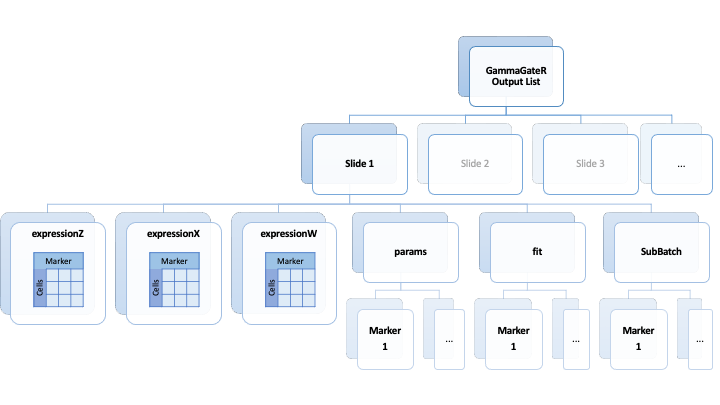

```{r, include = FALSE}
knitr::opts_chunk$set(
  collapse = TRUE,
  comment = "#>"
)
```

```{r setup}
library(GammaGateR)
library(gridExtra)
library(ggpubr)
library(hrbrthemes)
```

# Introduction

GammaGateR is a semi-automated soft marker-gating procedure designed specifically for the marker intensity distributions observed in multiplexed imaging. The algorithm uses a zero-inflated two-component Gamma Mixture Model to model marker expression for each slide. The Gamma mixture model naturally identifies marker-positive and marker-negative cell distributions and returns the probability of belonging to the marker-positive cell distribution for each cell. The returned probabilities can either be used directly in subsequent analysis or combined and dichotomized to define cell phenotypes. GammaGateR incorporates user-specified constraints to provide consistent model fit across a large number of slides. The model evaluation methods included in GammaGateR allow the user to evaluate the constraints and quality check results. The power source of GammaGateR is the closed-form Gamma mixture model, which is a novel approach to phenotyping for mIF data that makes it more computationally efficient than traditional GMMs.


# Loading mIF data from `VectraPolarisData`

The `VectraPolarisData` package on Bioconductor contains multiplex immunohistochemistry (mIHC) in a sample of 153 patients with small cell lung cancer[@johnson2021cancer;@VectraPolarisData]. To download the dataset, follow the instruction at the [package site](https://bioconductor.org/packages/release/data/experiment/html/VectraPolarisData.html). After installation, run the following to store data as the `cell` object. The data is are cell-level, meaning that each row of the data represents a single cell.

```{r, message=FALSE, warning=FALSE}
library(VectraPolarisData)
spe_lung <- HumanLungCancerV3()
# get the cell level imaging data with spatial coordinates
cell = cbind(as.data.frame(colData(spe_lung)), as.data.frame(spatialCoords(spe_lung)) )
```

For the purpose of building the vignette without exhausting all your computational power, this vignette will only use a subset of the dataset for demonstration.

```{r}
slides <- unique(cell$slide_id)[1:15]
cell <- cell[cell$slide_id %in% slides,]
```


# Prepare the data for GammaGateR

## Normalization and Visualization {.tabset}

Before fitting the model, the expression levels should be normalized to reduce batch effects and variation among slides. We use a log normalization, based on prior work [@harris2022quantifying].

```{r preprocessing}
allMarkers = grep('^entire_cell_.*total$', names(cell), value=TRUE)[2:4]
# normalize the data 
nzNormedMarkers = paste0('nzNorm_',allMarkers)
cell = do.call(rbind, lapply(split(cell, cell$slide_id), function(df){df[,nzNormedMarkers] = log10(1+sweep(df[,allMarkers], 2, colMeans(replace(df[,allMarkers], df[,allMarkers]==0, NA), na.rm = TRUE ), FUN = '/' ) ); df }) )
```

Because GammaGateR can use user specified constraints based on quantile and/or fixed value boundaries, it is helpful to visualize histograms of each channel by slide to get a coarse understanding of the overall distribution of normalized expression data, which serves as a good visual aid for a first guess of the constraints.

```{r results='asis'}
# plot histogram
for(i in 1:length(allMarkers)){
  cat('\n### ', allMarkers[i], " \n")
  col.name <- nzNormedMarkers[i]
  slidetest <- cell[, c("slide_id", col.name)]
  slidetest <- slidetest[slidetest[,col.name]!=0,]
  colnames(slidetest)[2] <- "mkr.val"
  p1 <- ggplot() + ggtitle(col.name)+
  geom_freqpoly(data=slidetest, aes(mkr.val,y=after_stat(density), color=slide_id,group=slide_id), binwidth = 0.05, alpha=0.1, linewidth=1)+theme_ipsum()+theme(legend.position = "none")
  print(p1)
  cat('\n\n')
}
```

## Picking Constraints

Different constraints can be selected for each marker but should be the same for all slides in the same channel. There are two ways to identify the constraints: by specifying a quantile or a particular value on the x-axis. For example, when setting the upp. Both can be passed as arguments to the GammaGateR function, and when applied to the slide, the threshold with the wider range will be chosen by the function automatically.

The quantile boundaries can be determined if there are known ranges for the proportions of positive cells, though these values don’t map specifically to constraints on the estimated cell proportions. The constraints are passed to the groupGammaGateR function as a list. Each constraint is specified with a 2x2 matrix, where the rows correspond to the unexpressed and expressed cell populations, and the columns are the lower and upper constraints, respectively. For example, the first constraint in quantileBoundaries restricts the mode of the unexpressed cells to be between the 0th and 70th quantiles of the expression distribution and the expressed cell mode between the 80th and 100th quantiles. The order of the markers is as shown in the histograms above. If no reasonable constraint can be determined for a marker, it can be left blank. 

Constraints can also be specified according to values on the x-axis of the histograms. For example, the mode for the unexpressed cells for the CD8 marker in the is constrained between 0 and 0.25 and the mode for the expressed cells is constrained between 0.3 and infinity. This ensures that the modes of the two estimated distributions are separated by a gap of 0.05.  

The last line of the code assigns the names of the constraints to keep track of which were used for which markers. groupGammagater does not use the names of the constraints in fitting, but assumes the order of the constraints matches the order of the columns of the input data.


```{r}
# set up boundary for all markers
quantileBoundaries = list(matrix(c(0,.7, .8, 1), byrow = TRUE, nrow=2),
                          matrix(c(0,.6, .8, 1), byrow = TRUE, nrow=2),
                          matrix(c(0,.6, .8, 1), byrow = TRUE, nrow=2))
boundaries = list(NULL,
                  NULL,
                  matrix(c(0,.25, .3, 1), byrow = TRUE, nrow=2))
names(quantileBoundaries) = names(boundaries) = nzNormedMarkers
```


# Running GammaGateR

The groupGammaGateR function takes a data frame with the cell level data for each slide, a vector identifying slide membership, and list(s) of the boundaries on the expression or quantile scales. The `n.cores` argument can be used to run model fitting in parallel across slides.The last line saves the fitted model object as an `.RData` file.

```{r groupGammaGateR, eval=FALSE}
# fit cfGMM with groupGammaGateR
groupPolarisFit <- groupGammaGateR(cell[,nzNormedMarkers], 
                                slide = cell$slide_id,
                                 boundaryMarkers = boundaries,
                                qboundaryMarkers=quantileBoundaries,
                                n.cores = 3)
save(groupPolarisFit, file="groupPolarisFit.RData")
```

At this stage, checking if the model fits well through visualization has higher priority than extracting information in the output. The output structure will be explained in the later section.

# Evaluating Model fit

After fitting, `convCheck()` can be used to see if the model failed to converge in any slides or channels. The reason for non-convergence could be due to the constraints, or that too few observations are included in each slide. If the model fails to converge estimated parameters and probabilities are returned as NA.

```{r}
load("groupPolarisFit.RData")
convCheck(groupPolarisFit)
```


## Diagnostic Plots {.tabset}

For datasets with large numbers of slides, it may be infeasible to visually check each slide for “goodness of fit”. Under such circumstance, the GammaGateR diagnostic plot will be an easier way to spot potential problematic models. The diagnostic plot below illustrates two key parameters for each slide that are indicator of goodness of fit: the mode and proportion ($\lambda$) of expressed component. Often, if the estimated proportion of expressed cells is outside a reasonable range for the marker channel or if the slide is an outlier on the mode or lambda, it is likely that the slide did not fit well with the model set up. The plots are interactive, so we can see the name of the slide by hovering mouse over the point and scroll below to look at the fitted gamma distributions and the expression histogram for the slide. If not, or if the two components are too close then this can be fixed by refitting with different constraints.

For example, the diagnostic plot of CD19 shows that slide `#43 1-786-092` has extremely small second component proportion. Therefore, in the next step, user can pay attention to this slide and see if the fitted model for that particular slide looks reasonable.

```{r results='asis'}
nzNormedMarkers <- names(groupPolarisFit[[1]][[1]])
m1 <- strsplit(nzNormedMarkers[1], split="_")[[1]][4]
cat('\n### ', m1, " \n")
htmltools::tagList(plot(groupPolarisFit, marker=nzNormedMarkers[1], diagnostic=TRUE,interactive=TRUE, histogram=FALSE, print=FALSE)[[1]])
cat('\n\n')

for (i in (nzNormedMarkers[-1])){
  mkr.name <- strsplit(i, split="_")[[1]][4]
  cat('\n### ', mkr.name, " \n")
  print(htmltools::tagList(plot(groupPolarisFit, marker=i, diagnostic=TRUE,interactive=TRUE, histogram=FALSE, print=FALSE)[[1]]))
  cat('\n\n')
}
```

## Individual slide histograms {.tabset}

The individual density curves of fitted models for each slide can be used to further evaluate model fit. There are two parts for each model in the individual slide:

1. The plot: visualization of model "goodness-of-fit".
   - The fitted gamma density curve for the two components.
   - The histogram of actual normalized pixel value. Plotted in the back for comparison. 
2. The table: shows the estimated parameters for the model.
   - Components 0-2 correspond to the estimates for the zeros, unexpressed, and expressed cells.
   - Lambda represents the estimated proportion of cells in that group
   - Alpha and beta parameters are the estimates for that control the shape of the distribution for that component. 
   - Also included model convergence on the boundary or not
   - Mode of each component. This can to some extent show whether adjusting the boundary can help improve the fitted models.
   
The fitted curves of the model should approximately align with the histogram. In addition, we expect that the marker-positive cell distribution should sit to the right of the unexpressed cells. This is not always possible if the amount of noise in the dataset is too much to distinguish expressed and unexpressed cells. For the purpose of display, only histograms of 4 slides are displyed for each marker. Users can print out the rest of the histograms, if they wish to, by modifying the `slide` argument of the plot function.

```{r results='asis', warning=FALSE, fig.height=10, fig.width=15}
for (i in (nzNormedMarkers)){
  mkr.name <- strsplit(i, split="_")[[1]][4]
  cat('\n### ', mkr.name, " \n")
  temp <- groupPolarisFit[1:4]
  class(temp) <- "groupGammaGateR"
  plotss <- plot(temp, marker=i, diagnostic=FALSE, histogram=TRUE, print=FALSE, tabl=TRUE)
  print(do.call(ggarrange,plotss))

  cat('\n\n')
}
```

#	Refitting the models

Based on the model diagnostic plots and slide histograms, we can see that CD14 and CD8 could use a lower boundary constraint of 0.5 for the expressed cells, e.g. 0.4.

The following constraints reflects the changes. 

```{r eval=FALSE}
# set up boundary for all markers
quantileBoundaries2 = list(matrix(c(0,.7, .8, 1), byrow = TRUE, nrow=2),
                          matrix(c(0,.6, .8, 1), byrow = TRUE, nrow=2),
                          matrix(c(0,.6, .8, 1), byrow = TRUE, nrow=2))

boundaries2 = list(matrix(c(0,.4, .4, Inf), byrow = TRUE, nrow=2),
                  matrix(c(0,.4, .6, 1), byrow = TRUE, nrow=2),
                  matrix(c(0,.4, .5, 1), byrow = TRUE, nrow=2))
names(quantileBoundaries2) = names(boundaries2) = nzNormedMarkers

# refit cfGMM with groupGammaGateR
groupPolarisFit2 <- groupGammaGateR(cell[,nzNormedMarkers], 
                                slide = cell$slide_id,
                                 boundaryMarkers = boundaries2,
                                qboundaryMarkers=quantileBoundaries2,
                                n.cores = 3)
save(groupPolarisFit2, file="groupPolarisFit2.RData")
```

Again, we need to check if all models converged.
```{r}
load("groupPolarisFit2.RData")
convCheck(groupPolarisFit2)
```


#	Evaluating new model fit 

In order to decide if the new boundary actually improved model fit, the model fitted with old and new boundaries should be visualized together to compare. `GammaGateR` can compare two model fits in both diagnostic plots and the histograms. 

## Compare two fittings: Diagnostic plots  {.tabset}

`diag_contrast` in `GammaGateR` returns a scatter plot similar to the previous diagnostic plot, color coded by fittings. Points that correspond to the same slide be different models are connected by a dashed line, which makes it easy to see how model fitting outcome of expressed cells moves under different boundaries.

```{r  results='asis',warning=FALSE}
for (i in nzNormedMarkers){
  mkr.name <- strsplit(i, split="_")[[1]][4]
  cat('\n### ', mkr.name, " \n")
  print(diag_contrast(groupPolarisFit, groupPolarisFit2, marker = i, title = paste0("contrastive: ", mkr.name)))
  cat('\n\n')
}
```

## Compare two fittings: Histograms {.tabset}

In `hist_sr_contrast`, the histogram is plotted very similar to the `plot` function previously. In order to compare the results, the density curve of both models are plot in the same histogram, color coded the same way as in the contrastive diagnostic plot: green is the first fit object and red is the second fit object. This provides a closer look to the individual slide fittings.

```{r results='asis', warning=FALSE}
for (i in nzNormedMarkers){
  mkr.name <- strsplit(i, split="_")[[1]][4]
  cat('\n### ', mkr.name, " \n")
  for(j in 4:7){
    plotss <- hist_sr_constrast(groupPolarisFit, groupPolarisFit2, marker=i, slide=j ,diagnostic=FALSE, histogram=TRUE, print=TRUE, tabl=TRUE)
  }
  cat('\n\n')
}
```


#	Model results output

The output structure is as follows:



Specifically, the output contains lists of slides output, where the output includes a variety of model and input information:

- `expressionZ` is the posterior probabilities
- `expressionX` is the input expression values
- `expressionW` is the marginal probabilities
- `params` is the zero-inflated prarameteres
- `fit` is the `cfGMM` package model output
- `subBatch` is the subBatch model fit parameter, if fitted with futher breakdown parameters within a slide. Each output facet includes a list of the marker-specific outputs.

At this stage, the model output is ready for next-step analysis. The major part of the output are the expression probability of each cell. `GammaGateR` provides posterior and marginal probability in `expressionZ` and `expressionW` separately. Since `GammaGateR` model fitting output belong to class `list`, the output can simply be extracted by going to the specific list. Suppose we need posterior probability from slide `#01 0-889-121`.

```{r eval=FALSE}
post_01_0_889_121 <- groupPolarisFit2[["#01 0-889-121"]][["expressionZ"]]
```

Of course, we can also easily extract posterior probability of all cells:
```{r eval=FALSE}
post_all <- do.call(rbind, (lapply(groupPolarisFit2, "[[", "expressionZ")))
```

In the examples we demonstrated in paper, posterior probability always outperforms marginal probability. However, marginal probability might be a more reasonable choice when the distribution is unimodal. In this scenario, the two components in the mixture model will appear to be overlapping a lot and the posterior probability will be zero for all cells.

```{r}
ploti <- plot(groupPolarisFit2, slide="#04 2-223-153",
              marker="nzNorm_entire_cell_cd14_opal_540_total", diagnostic=FALSE, histogram=TRUE)
```


```{r include=FALSE, eval=FALSE}
# fit astir
# split data and save 
slides <- unique(cell$slide_id)
for(i in slides){
  sub.cell <- cell[cell$slide_id==i, 
                   c("entire_cell_ck_opal_570_total","entire_cell_hladr_opal_690_total",
                     "entire_cell_cd3_opal_520_total" ,"entire_cell_cd8_opal_620_total",
                     "entire_cell_cd14_opal_540_total", "entire_cell_cd19_opal_650_total")]
  names(sub.cell) <- c( "ck", "hladr", "cd3", "cd8","cd14",  "cd19")
  name.i <- paste0(unlist(strsplit(i, " ")), collapse="-")
  write.csv(sub.cell, file = paste0("/media/disk2/atlas_mxif/astirPolaris/data/", name.i, ".csv"))
}
```

```{r include=FALSE, eval=FALSE}
markers <- c("ck","cd3","cd8","cd14","cd19")
fitmarkers <- c("nzNorm_entire_cell_ck_opal_570_total","nzNorm_entire_cell_hladr_opal_690_total",
                "nzNorm_entire_cell_cd3_opal_520_total",
                "nzNorm_entire_cell_cd8_opal_620_total", "nzNorm_entire_cell_cd14_opal_540_total",
                "nzNorm_entire_cell_cd19_opal_650_total")
# yaml comb
yamlComb <- function(df.markers){
  names(df.markers) <- c("ck","hladr","cd3","cd8","cd14","cd19")
  ck <- df.markers[,"ck"]>0.5
  hladr <- df.markers[,"hladr"]>0.5
  cd8 <- df.markers[,"cd3"]>0.5 & df.markers[,"cd8"]>0.5
  cd14 <- df.markers[,"cd3"]>0.5 & df.markers[,"cd14"]>0.5
  cd19 <- df.markers[,"cd3"]>0.5 & df.markers[,"cd19"]>0.5
  type.df <- data.frame(ck, hladr, cd8, cd14, cd19)
  return(type.df)
}

# astir
f.name <- list.files("/media/disk2/atlas_mxif/astirPolaris/astirFit")
f.name <- f.name[f.name!="#83-6-404-198_astir_res.csv"]
astir_all <- cfgmm_z <- cfgmm_w <- list()
batch.slide <- NULL
for(i in 1:length(f.name)){
  astir.i <- read.csv(file = paste0("/media/disk2/atlas_mxif/astirPolaris/astirFit/", f.name[i]))
  astir.cat <- apply(astir.i, 1, which.max)
  astir.cat <- colnames(astir.i)[astir.cat]
  astir.mat <- matrix(colnames(astir.i),ncol=6, nrow=nrow(astir.i), byrow = TRUE)==
               matrix(astir.cat,ncol=6, nrow=nrow(astir.i), byrow = FALSE)
  colnames(astir.mat) <- colnames(astir.i)
  seg.names <- strsplit(strsplit(f.name[i], "_astir_res.csv")[[1]][1], "-")[[1]]
  slide.name <- paste(seg.names[1], paste0(seg.names[2:4], collapse = "-"))
  fit.cfgmm <- groupPolarisFit[[slide.name]]

  cfgmm_z[[i]] <- yamlComb(fit.cfgmm[["expressionZ"]][,fitmarkers])
  cfgmm_w[[i]] <- yamlComb(fit.cfgmm[["expressionW"]][,fitmarkers])
  astir_all[[i]] <- astir.mat
  
  batch.slide <- c(batch.slide, rep(slide.name, nrow(astir.mat)))
}
cfgmm_z <- do.call(rbind, cfgmm_z)
cfgmm_w <- do.call(rbind, cfgmm_w)
astir_all <- do.call(rbind, astir_all)
astir_all <- astir_all[,1:5]
```


```{r include=FALSE, eval=FALSE}
# Application of Survival

# Summary of spatial feature: use Ripley's K for fixed radius: 6 types of pairs
# 
# predict survival using summary feature (random forest survival package). glmnet package.

library(spatstat)
survival.df <- metadata(spe_lung)[[1]]
radius <- 50
markers <- c('ck','hladr', 'cd8', 'cd14', 'cd19')

extract.r <- function(k.fit, radius=50){if(is.numeric(k.fit)){0
  }else{
  # last.col <- sum(!apply(single.K.var.list[[4]], 2, function(vec){any(is.na(vec))}))
  k.fit[which.min(abs(k.fit$r-radius)), "border"]
}}
sample.covar <- function(sample.in, k.radius=50){
  sample.mat <- sample.in[,1:5]
  coord.xy <- sample.in[,6:7]
  prop.var <- colMeans(sample.mat, na.rm = TRUE)
  w = convexhull.xy(coord.xy[,1], coord.xy[,2])
  single.K.var.list <- apply(sample.mat, 2, 
                        function(samp){
                          as.data.frame(Kest(as.ppp(coord.xy[samp,], W=w, correction = "border")))
                          })
  single.K.var <- lapply(single.K.var.list, extract.r, radius=k.radius)
  combs <- combn(1:ncol(sample.mat),2)
  colnames(combs) <- apply(combs, 2, function(i2)paste0(colnames(sample.mat)[i2], collapse=""))
  double.K.var.list <- apply(combs, 2,
                        function(i2){
                          dvars <- sample.mat[,i2]
                          if(any(colMeans(dvars)==0)){
                            return(0)
                          } else {
                            as.data.frame(Kmulti(as.ppp(coord.xy, W=w, correction = "border"), dvars[,1],dvars[,2]))
                          }
                          })
  double.K.var <- lapply(double.K.var.list, extract.r, radius=k.radius)
  res.sample <- c(prop.var, unlist(single.K.var), unlist(double.K.var))
  return(res.sample)
}

slide.covar <- function(slide.mat, k.radius=50){
  # slide.mat should have an extra column: sample_id, as the first column
  sample.id <- slide.mat[,1]
  slide.mat <- slide.mat[,-1]
  slide.lists <- split(slide.mat, sample.id)
  res.list <- lapply(slide.lists, sample.covar, k.radius=k.radius)
  res.mat <- do.call(rbind, res.list)
  res.mat[which(is.na(res.mat))] <- 0
  return(colMeans(res.mat, na.rm = TRUE))
}

all.covar <- function(all.mat, k.radius=50){
  all.mat <- cbind(samples, all.mat, coord.xys)
  slide.list <- split(all.mat, batch.slide)
  res.list <- lapply(slide.list, slide.covar, k.radius=k.radius)
  return(do.call(rbind, res.list))
}

# all.results <- list(astir_all, cfgmm_z, cfgmm_w)
# all.covariates <- mclapply(all.results, all.covar, mc.cores = 3)
coord.xys <- NULL
samples <- NULL
# batch.slide.old <- batch.slide
# batch.slide <- batch.slide[batch.slide!="#83 6-404-198"]
for(i in 1:length(unique(batch.slide))){
  coord.xys <- rbind(coord.xys, cell[cell$slide_id==unique(batch.slide)[i], c("cell_x_position", "cell_y_position")])
  samples <- c(samples, cell[cell$slide_id==unique(batch.slide)[i], "sample_id"])
  print(i)
}
astir.cov <- all.covar(astir_all)
GammaGateRw.cov <- all.covar(cfgmm_w[batch.slide.old!="#83 6-404-198",])
GammaGateRz.cov <- all.covar(cfgmm_z[batch.slide.old!="#83 6-404-198",])
cov.all <- list(astir.cov, GammaGateRw.cov, GammaGateRz.cov)
save(cov.all, file="/media/disk2/atlas_mxif/astirCov.RData")

# Survival Analysis
library(glmnet)
library(survival)
surv.y <- Surv(survival.df$survival_days, survival.df$survival_status)
fit.astir <- glmnet(ripley.res[[1]], surv.y, family = "cox")
fit.z <- glmnet(ripley.res[[2]], surv.y, family = "cox")
fit.w <- glmnet(ripley.res[[3]], surv.y, family = "cox")
par(mfrow=c(2,2))
plot(fit.astir)
plot(fit.z)
plot(fit.w)

set.seed(1)
cvfit.astir <- cv.glmnet(ripley.res[[1]], surv.y, family = "cox", type.measure = "C")
cvfit.z <- cv.glmnet(ripley.res[[2]], surv.y, family = "cox", type.measure = "C")
cvfit.w <- cv.glmnet(ripley.res[[3]], surv.y, family = "cox", type.measure = "C")
par(mfrow=c(2,2))
plot(cvfit.astir)
plot(cvfit.z)
plot(cvfit.w)

library(randomForestSRC)
surv.df <- data.frame(slide_id=unique(batch.slide))
surv.df <- left_join(surv.df, survival.df, by="slide_id")
surv.df$stage_at_diagnosis <- as.factor(surv.df$stage_at_diagnosis)

base.df <- surv.df[, c("age_at_diagnosis","stage_at_diagnosis",
                       "survival_days","survival_status")]
fit.base <- rfsrc(Surv(survival_days,survival_status)~., base.df,
             ntree = 1000, nodesize = 5, nsplit = 50, importance = TRUE)
base.c <- get.cindex(fit.base$yvar[,1], fit.base$yvar[,2], fit.base$predicted.oob)

astir.cov.df <- as.data.frame(astir.cov)
colnames(astir.cov.df)[1:5] <- paste0("prop", markers)
surv.astir.df <- cbind(surv.df[, c("age_at_diagnosis","stage_at_diagnosis",
                                   "survival_days","survival_status")], astir.cov.df)
fit.astir <- rfsrc(Surv(survival_days,survival_status)~., surv.astir.df,
             ntree = 1000, nodesize = 5, nsplit = 50, importance = TRUE)
astir.c <- get.cindex(fit.astir$yvar[,1], fit.astir$yvar[,2], fit.astir$predicted.oob)

GammaGateRw.cov.df <- as.data.frame(GammaGateRw.cov)
colnames(GammaGateRw.cov.df)[1:5] <- paste0("prop", markers)
surv.w.df <- cbind(surv.df[, c("age_at_diagnosis","stage_at_diagnosis",
                               "survival_days","survival_status")], GammaGateRw.cov.df)
fit.w <- rfsrc(Surv(survival_days,survival_status)~., surv.w.df,
             ntree = 1000, nodesize = 5, nsplit = 50, importance = TRUE)
w.c <- get.cindex(fit.w$yvar[,1], fit.w$yvar[,2], fit.w$predicted.oob)

GammaGateRz.cov.df <- as.data.frame(GammaGateRz.cov)
colnames(GammaGateRz.cov.df)[1:5] <- paste0("prop", markers)
surv.z.df <- cbind(surv.df[, c("age_at_diagnosis","stage_at_diagnosis",
                               "survival_days","survival_status")], GammaGateRz.cov.df)
fit.z <- rfsrc(Surv(survival_days,survival_status)~., surv.z.df,
             ntree = 1000, nodesize = 5, nsplit = 50, importance = TRUE)
z.c <- get.cindex(fit.z$yvar[,1], fit.z$yvar[,2], fit.z$predicted.oob)
c(astir.c, w.c, z.c, base.c)

## obtain Brier score using KM and RSF censoring distribution estimators
bs.base <- get.brier.survival(fit.base, cens.mode = "rfsrc")$brier.score
bs.astir <- get.brier.survival(fit.astir, cens.mode = "rfsrc")$brier.score
bs.w <- get.brier.survival(fit.w, cens.mode = "rfsrc")$brier.score
bs.z <- get.brier.survival(fit.z, cens.mode = "rfsrc")$brier.score

## plot the brier score
plot(bs.astir, type = "s", col = 2, ylim=c(0, 0.35), main="Brier Score Comparison")
lines(bs.base, type ="s", col = 3)
lines(bs.w, type ="s", col = 4)
lines(bs.z, type ="s", col = 5)
legend("bottomright", legend = c("astir","base", "GammaGateR_marginal", "GammaGateR_posterior"), fill = 2:5)
```

```{r fig.height=4, fig.width=20,eval=FALSE, include=FALSE}
# make plots for normalization

  slidetest <- cell[, c("slide_id", "nzNorm_entire_cell_hladr_opal_690_total")]
  slidetest <- slidetest[slidetest[,"nzNorm_entire_cell_hladr_opal_690_total"]!=0,]
  ggplot() + ggtitle("hladr Normalized")+
  geom_freqpoly(data=slidetest, aes(nzNorm_entire_cell_hladr_opal_690_total,y=after_stat(density), color=slide_id,group=slide_id), binwidth = 0.05, alpha=0.2, linewidth=0.5)+theme_ipsum()+xlab("Expression")
```

